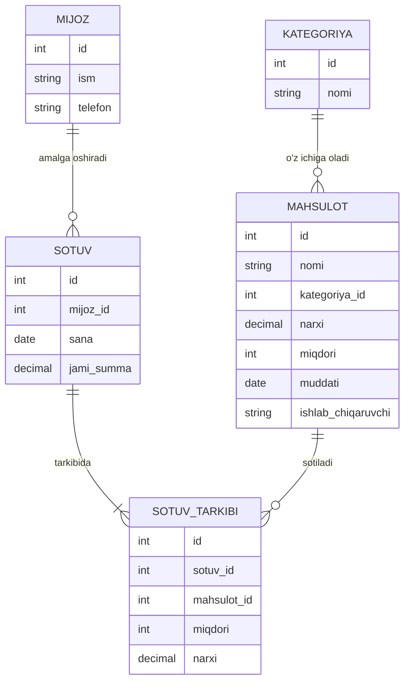

# SMART DO'KON — MANTIQIY MODEL

## 1. Kategoriya
Mahsulotlarni guruhlarga ajratish uchun ishlatiladi.

Maydonlari:
- id
- nomi

Misol:
Ichimliklar, Sut mahsulotlari, Shirinliklar

## 2. Mahsulot
Do'konda sotiladigan mahsulotlar haqidagi ma'lumotlarni saqlaydi.

Maydonlari:
- id
- nomi
- kategoriya_id
- narxi
- miqdori
- muddati
- ishlab_chiqaruvchi

## 3. Mijoz
Do'kon mijozlari haqidagi ma'lumotlarni saqlaydi.

Maydonlari:
- id
- ism
- telefon

## 4. Sotuv
Har bir amalga oshirilgan savdoni saqlaydi.

Maydonlari:
- id
- mijoz_id
- sana
- jami_summa

## 5. Sotuv tarkibi
Bitta sotuvda qaysi mahsulotlardan nechta sotilganini saqlaydi.

Maydonlari:
- id
- sotuv_id
- mahsulot_id
- miqdori
- narxi

## 6. Foydalanuvchi
Tizimdan foydalanadigan xodimlarni saqlaydi.

Maydonlari:
- id
- login
- parol
- rol

Rollar:
- Administrator
- Sotuvchi
- Omborchi

## Jadvallar orasidagi bog'lanish

Kategoriya → Mahsulot

Mijoz → Sotuv

Sotuv → Sotuv tarkibi

Mahsulot → Sotuv tarkibi

## Do'kon ma'lumotlar bazasining mantiqiy diagrammasi

